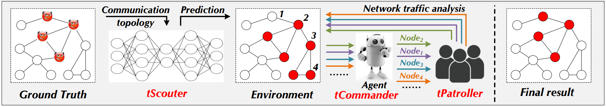

### TNT: A Large-Scale P2P Botnet Detection Framework via Communication Topology and Network Traffic



## Introduction

TNT is a detection framework for large-scale P2P botnet that combining communication topology and network traffic. TNT includes three tightly-coupled components: (i) tScouter is responsible for profiling the communication topology; (ii) tCommander plans the strategy for node inspection; and (iii) tPatroller investigates the traffic of the corresponding node. Taken together, TNT advances the trade-off between detection effect and overhead. This anonymous repository displays the corresponding source code for model implementation, as well as dataset. 

## Requirements

```bash
pip install numpy
pip install pandas
pip install tqdm
pip install pyecharts
pip install pickle
pip install torch
```

## Dataset
We utilize OMNet simulation to generate traffic for 7 common P2P protocols, includig 'Bamboo', 'Broose', 'Chord', 'Gia', 'Kademlia', 'Koorde', 'Nice'. 
The ./dataset/ folder stores the graph instance of each-type P2P protocol. We will put the entire dataset on the cloud disk. 

## Model 

The 'Agent' is defined in ./model/rl_agent.py.

The environment and rewards are implemented in ./model/graph_rl.py.

The main function is stored in ./model/run_rl.py.
```bash
python run_rl.py
```

## Evaluation

A series of additional evaluation results are stored in the ./evaluation/ folder. 

### References
- [Realtime Robust Malicious Traffic Detection via Frequency Domain Analysis](https://dl.acm.org/doi/10.1145/3460120.3484585), Chuanpu Fu, Qi Li, Meng Shen, and Ke Xu - CCS 2021
- [Automating Botnet Detection with Graph Neural Networks](https://arxiv.org/abs/2003.06344), Jiawei Zhou, Zhiying Xu, Alexander M. Rush, and Minlan Yu - arXiv 2020